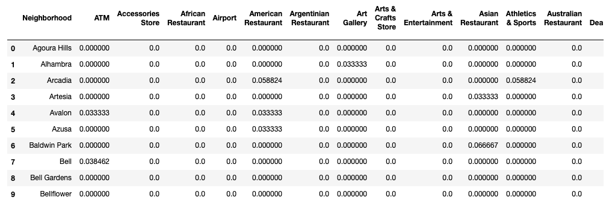

# Final Report

## Business Problem

An investor would like to open a new restaurant in Los Angeles. Unfortunately, the investor doesn't know Los Angeles very well and actually has no idea about where to locate the restaurant. Whether it is a good idea to open it in downtown or some specific districts.

## Data

A list of cities in Los Angeles County from Wikipedia: https://en.wikipedia.org/wiki/List_of_cities_in_Los_Angeles_County,_California    

Foursquare location data to take info about venues from each district. Then I'll be able to make segmentation and profiling of districts and look at places best for opening new restaurant

## Methodology

* I have names of cities in Los Angeles and puted them on a Warsaw map:

Having data obtained from Foursqare API (list of nearby venues with their categories), I've used mainly Pandas to prepare data - wrangle them, join, make one-hote encoding:

Finding most common venues in each city:

After that preprocessing stage I've used K-means algorythym from scikit to find similar clusters similar to each other inside clusters, and as much as possible different among clusters:

##  Results 

* Cluster 0 - There are a lot of people. It is good for American food.

* Cluster 1 - Good place for restaurant. Top 3 are Mexican food, fast food and Asian food.

* Cluster 6 - Hotel zone. Good for fast food, like pizza and cafe, or American food.

* The rest clusters are not good for restaurants at all.

## Observations

Perhaps the most attracting place to open a resturant is cluster 1.    

However, it may also be a good idea to invest on restaurant in cluster 6 which is hotel zone because there are a large number of people move through every day.

## Conclusion

The analysis shows that clustering districts look reasonable (I know Warsaw), so we can conduct similar analysis for other cities all over the world without knowing them and in automatic manner find some similar clusters, profile them and take decisions as a investor.
